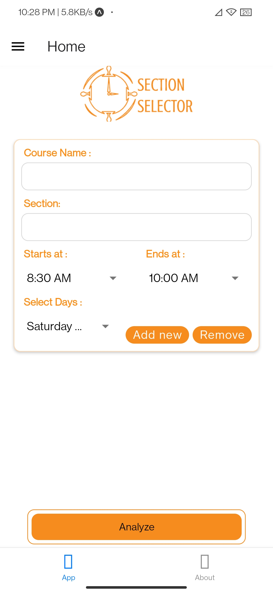
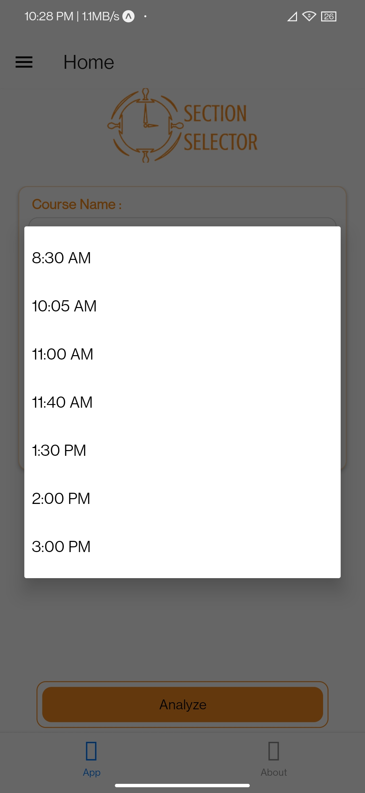
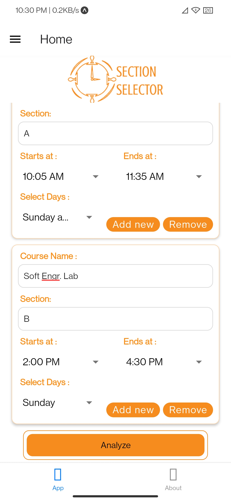
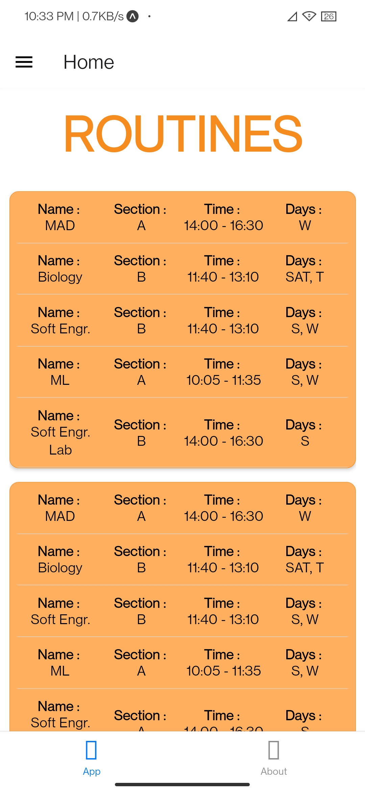
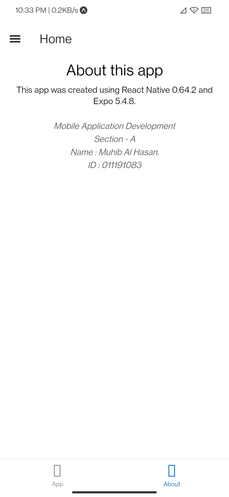
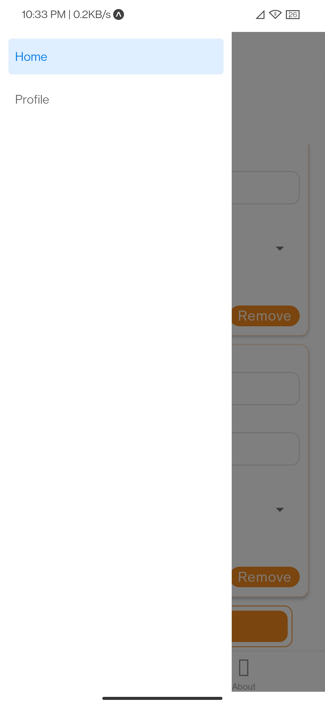

# Developed Using :

1. React Native 0.68.2
2. Expo ~45.0.0

# Developed By

### Muhib Al Hasan

##### United International University

##### Student ID : 011191083

.

# Features

1. UIU Students can enter their section details to find possible routines.
2. Users can save their information in SQLite Database.
3. Section information are stored in Local Storage, so the app will retain the information even after restarts.

# How to run on Windows :

1. Download and install Nodejs version 16.15.1 from [here](https://nodejs.org/en/download/).
2. Clone the git repo.
3. Open command prompt/powershell on the root directory of the project.
4. Make sure you have the correct node and npm version by using -

   > node --version

   v16.15.1

   > npm --version

   8.11.0

5. Write `npm install` and press Enter. (This may take 1/2 hours).
6. Write `expo start` and press Enter. This will start the development server and show the QR code.
7. Install Expo Go on your phone. You can find it on Play Store.
8. Open the Expo Go app and scan the QR code from the command prompt.

This will run the app on your device.

You can also use `expo build` to generate the apk for the app.

# App Details

 

## Main Screen

In this screen, you can enter your section details in the text fields. The times must be one of the values in the dropdown.  
You can click on "Add New" to add another section or "Remove" button to remove it.  
   

 

## Result Screen

By clicking the "Analyze" button in the previous screen, you can navigate to results, which will show you all of your possible routines.  
  
 

## About Page

From the bottom navigation tab, you can go to this page.

 

## App Drawer

Click on the button that looks like three lines to open the app drawer.

 

## Profile Page

Click on the "Profile" option from the app drawer to come here.  
You can enter you details in this page and click on update to save it on the SQLite Database.

 

# END
